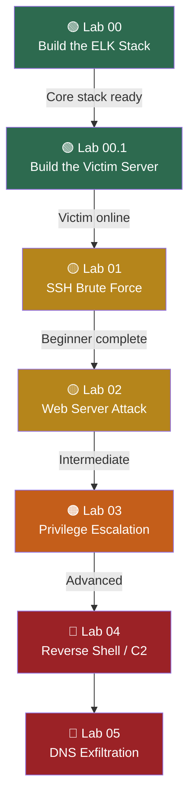

# Project ELK — Lab Modules

This branch contains all the hands-on lab modules for Project ELK. The labs are designed to be completed in order, starting with building the core infrastructure and progressively advancing through increasingly complex attack scenarios.

---

## Progression Path

---

## Infrastructure Labs

These labs set up the foundation. Complete both before moving on to any attack scenario.

### Lab 00 — Building the ELK Stack `Beginner`

Deploy Elasticsearch, Logstash, and Kibana in Docker on a shared network with security enabled. This is the core SIEM platform that all other labs feed into. You'll learn how each component connects, how to configure them with YAML files, and how to verify the stack is healthy.

### Lab 00.1 — Building the Victim Server `Beginner`

Build a monitored Ubuntu endpoint with OpenSSH, rsyslog, and Filebeat. This container generates real authentication logs and ships them through the ELK pipeline. You'll also learn how to containerize the setup with a Dockerfile for easy redeployment.

---

## Attack Scenario Labs

Each lab introduces a different attack type, walks through the simulation, and builds a detection rule in Kibana. The complexity increases as you progress — earlier labs focus on single-source log analysis while later labs involve multi-source correlation, encrypted traffic, and covert channels.

### Lab 01 — SSH Brute Force `Beginner`

**Attack:** Automated password guessing against an SSH server using Hydra.

**What you'll learn:** How brute-force attempts appear in authentication logs, how to create a custom query detection rule in Kibana, and how to verify alerts fire in the Security app. This is the simplest detection scenario and a great starting point.

### Lab 02 — Web Server Attack `Intermediate`

**Attack:** SQL injection and directory traversal against a web application.

**What you'll learn:** How to collect and parse web server access logs, identify malicious request patterns, and build detection rules for common web application attacks. Introduces Logstash grok filters for parsing structured log formats.

### Lab 03 — Privilege Escalation `Intermediate`

**Attack:** Exploiting misconfigurations to escalate from a normal user to root on a Linux host.

**What you'll learn:** How to monitor for suspicious privilege changes, detect unauthorized use of sudo or SUID binaries, and correlate multiple log events to identify an escalation chain. Introduces multi-field detection rules.

### Lab 04 — Reverse Shell / C2 Beacon `Advanced`

**Attack:** Establishing a reverse shell from a compromised host back to an attacker-controlled server, simulating command-and-control communication.

**What you'll learn:** How to detect outbound connections to unusual ports, identify beaconing patterns in network logs, and build threshold-based rules that catch periodic callbacks. Introduces network-level log collection alongside host logs.

### Lab 05 — DNS Exfiltration `Advanced`

**Attack:** Exfiltrating sensitive data by encoding it into DNS queries sent to an attacker-controlled domain.

**What you'll learn:** How to capture and analyze DNS query logs, detect anomalous query patterns (unusually long subdomains, high query volume to a single domain), and build detection rules for covert data channels. This is the most subtle attack in the series and requires correlating multiple indicators.

---

## Lab Index

| Lab | Attack Type | Difficulty |
|---|---|---|
| [Lab 00 — Building the ELK Stack](00-elk-setup/) | Infrastructure | Beginner |
| [Lab 00.1 — Building the Victim Server](00.1-victim-server/) | Infrastructure | Beginner |
| [Lab 01 — SSH Brute Force](01-ssh-bruteforce/) | Authentication Attack | Beginner |
| [Lab 02 — Web Server Attack](02-web-attack/) | Web Application Attack | Intermediate |
| [Lab 03 — Privilege Escalation](03-priv-escalation/) | Host-Based Attack | Intermediate |
| [Lab 04 — Reverse Shell / C2](04-reverse-shell/) | Network Attack | Advanced |
| [Lab 05 — DNS Exfiltration](05-dns-exfiltration/) | Covert Channel | Advanced |

Core ELK setup based on the tutorial [Setting Up ELK SIEM in Docker from A to Z](https://medium.com/@sundaeGAN/setting-up-elk-siem-in-docker-from-a-to-z-e765d8e3b96f) by sundaeGAN, with additional enhancements for security enablement, alerting, modular lab structure, and reproducibility. 

Claude.ai LLM as used to rough out most of the documentation for these labs.
