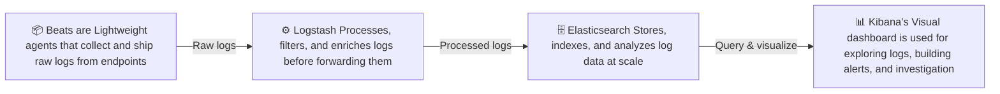
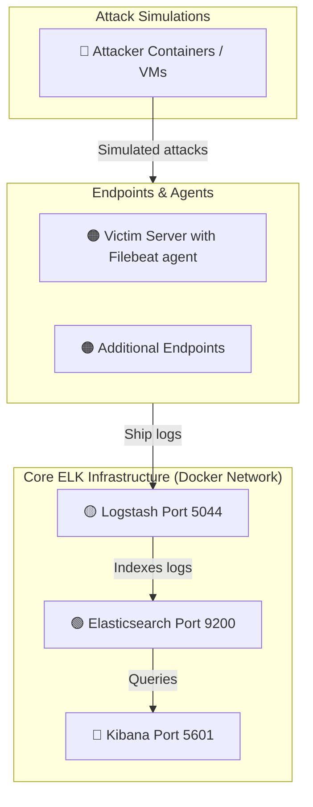

# ELK Stack Docker Home Lab — SIEM Detection & Alerting

A modular, hands-on home lab for learning security monitoring and threat detection using the Elastic Stack deployed entirely in Docker. Each lab module walks through a different phase of the build — from standing up the core SIEM infrastructure to simulating and detecting real-world attacks.

---

## What is SIEM?

SIEM stands for **Security Information and Event Management**. It is a security monitoring platform that collects logs from across your environment, analyzes them in real time, and alerts you when suspicious activity is detected. A SIEM helps security teams detect cyberattacks, investigate incidents, and make informed decisions based on centralized log data. Some SIEMs can even respond to threats automatically.

---

## What is the ELK Stack?

The ELK Stack is a collection of three open-source tools from Elastic that together form a powerful SIEM platform:



**Elasticsearch** is the core search and analytics engine. It stores all ingested logs and makes them searchable in near real time.

**Logstash** is the log processing pipeline. It receives logs from various sources, applies filters to parse, enrich, or transform them, and forwards the results to Elasticsearch.

**Kibana** is the web-based interface. It provides dashboards, a log explorer, a security app with built-in detection rules, and an alerting system for threat monitoring.

**Beats** are lightweight data shippers installed on endpoints. They collect specific types of logs (authentication logs, system metrics, network data, etc.) and forward them to Logstash or directly to Elasticsearch.

---

## Architecture Overview



All components run as Docker containers on a shared network. Attack simulations generate log activity on victim endpoints, which is collected by Beats agents, processed through Logstash, indexed in Elasticsearch, and surfaced in Kibana for detection and alerting.

---

## Lab Modules

This repository is organized into separate lab modules. Start with the infrastructure labs to build the stack, then work through the attack scenarios in any order.

### Infrastructure

| Lab | Description | Difficulty |
|---|---|---|

| [Lab 00 — Building the ELK Stack](labs/00-elk-setup/) | Deploy Elasticsearch, Logstash, and Kibana in Docker with security enabled | Beginner |

| [Lab 00.1 — Building the Victim Server](labs/00.1-victim-server/) | Build an Ubuntu container with Filebeat, rsyslog, and OpenSSH as a monitored endpoint | Beginner |

### Attack Scenarios

| Lab | Attack Type | Difficulty |
|---|---|---|

| [Lab 01 — SSH Brute Force](labs/01-ssh-bruteforce/) | Detect brute-force login attempts using Hydra and Kibana detection rules | Beginner |

| [Lab 02 — Web Server Attack](labs/02-web-attack/) | Detect SQL injection and directory traversal against a web server | Intermediate |

| [Lab 03 — Privilege Escalation](labs/03-priv-escalation/) | Detect suspicious privilege escalation activity on a Linux host | Intermediate |

| [Lab 04 — Reverse Shell / C2 Beacon](labs/04-reverse-shell/) | Detect outbound reverse shell connections and command-and-control traffic | Advanced |

| [Lab 05 — DNS Exfiltration](labs/05-dns-exfiltration/) | Detect data exfiltration through encoded DNS queries | Advanced |

> Each lab contains its own README with setup instructions, attack steps, detection rules, and expected results.

---

## Project Structure

```
ELK-stack-Docker-Home-Lab/
├── README.md                          ← You are here
└── labs/
    ├── 00-elk-setup/
    │   └── README.md
    ├── elasticsearch/
    │   └── elasticsearch.yml
    ├── kibana/
    │   └── kibana.yml
    ├── logstash/
    │   ├── logstash.conf
    │   └── pipelines.yml
    ├── 00.1-victim-server/
    │   ├── README.md
    │   ├── Dockerfile
    │   ├── filebeat.yml
    │   └── start.sh
    ├── 01-ssh-bruteforce/
    │   └── README.md
    ├── 02-web-attack/
    │   └── (coming soon)
    ├── 03-priv-escalation/
    │   └── (coming soon)
    ├── 04-reverse-shell/
    │   └── (coming soon)
    └── 05-dns-exfiltration/
        └── (coming soon)
```

---

## Security Notes

- **Enable xpack.security** in Elasticsearch for detection engine and alerting functionality.
- **Do not commit passwords.** Use environment variables or a `.env` file and add it to `.gitignore`.
- **Educational use only.** Only perform attack simulations on systems you own or have explicit permission to test.

---

## Acknowledgments

Core ELK setup based on the tutorial [Setting Up ELK SIEM in Docker from A to Z](https://medium.com/@sundaeGAN/setting-up-elk-siem-in-docker-from-a-to-z-e765d8e3b96f) by sundaeGAN, with additional enhancements for security enablement, alerting, modular lab structure, and reproducibility. 

Claude.ai LLM as used to rough out most of the documentation for these labs.
