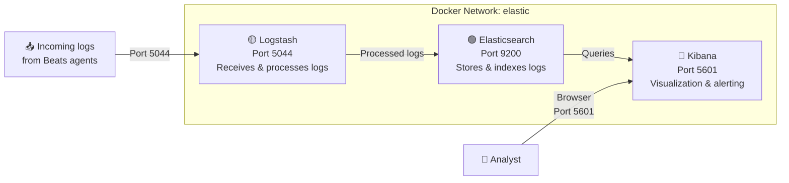

# Lab 00 — Building the ELK Stack

**Objective:** Deploy a fully functional Elasticsearch, Logstash, and Kibana stack in Docker with security enabled, ready to ingest and analyze logs from any lab module.

---

## What You Will Build



By the end of this lab you will have three containers running on a shared Docker network, with Elasticsearch security enabled so that Kibana's detection engine and alerting features are fully operational.

---

## Prerequisites

- [Docker Desktop](https://www.docker.com/products/docker-desktop/) installed and running
      - This is your Containerization Engine that will allocate resouces and isolate the containers from your host
  > **Note:** Docker desktop requires you install [WSL](https://learn.microsoft.com/en-us/windows/wsl/install), and requires Virtualization features be enabled on the host
- At least **4 GB of RAM** allocated to Docker
- PowerShell (Windows) or Terminal (macOS/Linux)
      - This is the interface where you will primarily interact with the Docker Engine and your containers 

---

## Step 1 — Create the Docker Network

All ELK containers need to communicate with each other by name. A custom Docker network makes this possible.

```bash
docker network create elastic
```

Verify it was created:

```bash
docker network ls
```

You should see `elastic` in the list.

> **Figure1.0:** Creating and verifiying the 'elastic' Docker network


---

## Step 2 — Deploy Elasticsearch

### 2.1 Pull the Image 

> **Note:** At the time of this labs creation the latest release of Elasticsearch, Logstash, and Kibana is v9.3.1. Check for latest versions before pulling images. 

```bash
docker pull docker.elastic.co/elasticsearch/elasticsearch:9.3.2
```

### 2.2 Create the Configuration File

Create a folder on your host in your directory of choice for the Elasticsearch config files, then create `elasticsearch.yml` inside it
It is important to rmember that these cannot be .txt files and must be .yml 
please refer to figures 2.2.0-2.2.7:

> **Figure 2.2.0:** Creating a new folder and naming it 'ELK'


> **Figure2.2.1:** Changing the View settings to show file name extentions 


> **Figure2.2.2:** Creating a new text document


> **Figure2.2.3:** Naming the document 'elasticsearch.yml' 


> **Figure2.2.4:** Selecting 'Yes' to confirm change from .txt to .yml file type


> **Figure2.2.5:** Opening 'elasticsearch.yml' with notepad


Copy the YAML configuraiton below and paste it into 'elasticsearch.yml' and save:

```yaml
# Cluster name
cluster.name: "docker-cluster"

# Allows it to be accessed from anywhere
network.host: 0.0.0.0

# Runs as a single-node cluster (no multi-node discovery)
discovery.type: single-node

# Enables Elasticsearch security features
xpack.security.enabled: true
```

> **Figure2.2.6:** Contents of 'elasticsearch.yml'


> **Note:** The original tutorial sets `xpack.security.enabled: false` for simplicity. We enable it here because Kibana's detection engine and alerting require authentication. If you want to start without security and enable it later, set this to `false` and revisit [Enabling Security](#enabling-security-after-initial-setup) at the end of this lab.

### 2.3 Run the Container

In Powershell, navigate to the directory where you created `elasticsearch.yml` and run the commands below:

```bash
docker run --name es01 --net elastic -p 9200:9200 -it -m 1GB `
-v ${PWD}/elasticsearch.yml:/usr/share/elasticsearch/config/elasticsearch.yml `
docker.elastic.co/elasticsearch/elasticsearch:9.3.2
```
> **Figure2.3.0:** Folder navigation and command execution


**What this does:**

| Flag | Purpose |
|---|---|
| `--name es01` | Names the container `es01` so other containers can reach it by hostname |
| `--net elastic` | Attaches to the shared Docker network |
| `-p 9200:9200` | Exposes Elasticsearch on your host at port 9200 |
| `-m 1GB` | Limits memory usage to 1 GB |
| `-v ...` | Mounts your local config file into the container |

### 2.4 Set Built-in User Passwords

With security enabled, you need to configure passwords for the built-in accounts. Open a new terminal and run:

```bash
docker exec -it es01 /usr/share/elasticsearch/bin/elasticsearch-setup-passwords interactive
```

This will prompt you to set passwords for several accounts. **Write these down** — you will need them throughout the lab:

> **NOTE:** For security purposes when entering your passwords, they will not appear as they are typed in the interface 

> **Figure2.4.0:** Setting paswords


| Account | Used By |
|---|---|
| `elastic` | Superuser account — used to log into Kibana |
| `kibana_system` | Kibana's internal connection to Elasticsearch |
| `logstash_system` | Logstash monitoring (optional) |

### 2.5 Verify Elasticsearch is Running 

> **NOTE:** Ensure to use the password you created for elastic during step 2.4

```bash
curl.exe -u elastic:YOUR_PASSWORD http://localhost:9200
```

You should receive a JSON response containing the cluster name and version info.

> **Figure2.5.0:** JSON output


---

## Step 3 — Deploy Kibana

### 3.1 Pull the Image

```bash
docker pull docker.elastic.co/kibana/kibana:9.3.2
```

### 3.2 Create the Configuration File

Create `kibana.yml` in a Kibana config folder:

```yaml
# Allows it to be accessed from anywhere
server.host: "0.0.0.0"

# Waiting time before shutting down to power off safely
server.shutdownTimeout: "30s"

# Connects to the Elasticsearch container by hostname
elasticsearch.hosts: [ "http://es01:9200" ]

# Credentials for Kibana's internal connection to Elasticsearch
elasticsearch.username: "kibana_system"
elasticsearch.password: "<YOUR_KIBANA_SYSTEM_PASSWORD>"

# Enables the monitoring UI
monitoring.ui.container.elasticsearch.enabled: true

# Encryption key required by many Kibana features (min 32 characters)
xpack.encryptedSavedObjects.encryptionKey: "<MIN_32_CHAR_RANDOM_STRING>"
```

**To generate the encryption key**, run this in PowerShell:

```powershell
[System.Convert]::ToBase64String(
  (1..32 | ForEach-Object {Get-Random -Minimum 0 -Maximum 256})
)
```

Or on Linux/macOS:

```bash
openssl rand -base64 32
```

### 3.3 Run the Container

```bash
docker run --name kib01 --net elastic -p 5601:5601 `
-v ${PWD}/kibana.yml:/usr/share/kibana/config/kibana.yml `
docker.elastic.co/kibana/kibana:9.3.2
```

### 3.4 Access Kibana

Open your browser and navigate to **http://localhost:5601**. Log in with:

- **Username:** `elastic`
- **Password:** the password you set in Step 2.4

It may take a minute or two for Kibana to fully initialize on first launch.

---

## Step 4 — Deploy Logstash

### 4.1 Pull the Image

```bash
docker pull docker.elastic.co/logstash/logstash:9.3.2
```

### 4.2 Create the Pipeline Configuration

Create `logstash.conf`:

```
input {
    beats {
        port => 5044
    }
}

filter {
    # Tags each log to confirm it passed through Logstash
    mutate {
        add_field => { "logstash_passed" => "true" }
    }
}

output {
    # Prints to console for debugging
    stdout { codec => rubydebug }

    elasticsearch {
        hosts => ["http://es01:9200"]
        index => "beat-logs"
        user => "elastic"
        password => "<YOUR_ELASTIC_PASSWORD>"
    }
}
```

### 4.3 Create the Pipelines File

Create `pipelines.yml` to tell Logstash which config to use:

```yaml
- pipeline.id: main
  path.config: "/usr/share/logstash/pipeline/logstash.conf"
```

**Make sure the indentation is correct** — YAML is whitespace-sensitive.

### 4.4 Run the Container

```bash
docker run --name logstash --net elastic -p 5044:5044 `
  -v ${PWD}/logstash.conf:/usr/share/logstash/pipeline/logstash.conf `
  -v ${PWD}/pipelines.yml:/usr/share/logstash/config/pipelines.yml `
  docker.elastic.co/logstash/logstash:9.3.2
```

Logstash takes a minute or two to start. Watch the logs for a line indicating the pipeline has started and the Beats input is listening on port 5044.

---

## Verification Checklist

Once all three containers are running, confirm everything is healthy:

| Check | Command / Action | Expected Result |
|---|---|---|
| Elasticsearch responds | `curl -u elastic:<PW> http://localhost:9200` | JSON with cluster name and version |
| Kibana loads | Open `http://localhost:5601` in browser | Login page, then Kibana home |
| Logstash pipeline running | `docker logs logstash` | Pipeline started, Beats input listening on 5044 |
| All containers on network | `docker network inspect elastic` | `es01`, `kib01`, `logstash` all listed |

---

## Startup Order

If you restart the stack, always bring containers up in this order:

1. **Elasticsearch** — wait until it's fully ready before starting the others
2. **Kibana** and **Logstash** — these depend on Elasticsearch being available

If services fail to connect after a restart, give Elasticsearch 30–60 seconds to initialize, then restart the dependent containers:

```bash
docker restart kib01 logstash
```

---

## Enabling Security After Initial Setup

If you initially deployed with `xpack.security.enabled: false` and want to enable it later:

1. Edit `elasticsearch.yml` and set `xpack.security.enabled: true`
2. Restart Elasticsearch: `docker restart es01`
3. Set passwords: `docker exec -it es01 /usr/share/elasticsearch/bin/elasticsearch-setup-passwords interactive`
4. Add `elasticsearch.username` and `elasticsearch.password` to `kibana.yml`
5. Add `user` and `password` to the Elasticsearch output block in `logstash.conf`
6. Restart Kibana and Logstash: `docker restart kib01 logstash`

---

## Troubleshooting

**Elasticsearch won't start:**
- Check Docker has at least 4 GB of RAM allocated
- Verify `elasticsearch.yml` syntax — YAML is whitespace-sensitive
- Check logs: `docker logs es01`

**Kibana shows "Kibana server is not ready yet":**
- Elasticsearch may still be starting — wait 1–2 minutes
- Verify `elasticsearch.hosts` in `kibana.yml` points to `http://es01:9200`
- If security is enabled, confirm the `kibana_system` password is correct

**Logstash pipeline won't start:**
- Check `pipelines.yml` indentation
- Verify `logstash.conf` syntax — missing brackets or quotes will cause failures
- Check logs: `docker logs logstash`

**Containers can't reach each other:**
- Confirm all containers are on the `elastic` network: `docker network inspect elastic`
- Restart any container that was accidentally started without `--net elastic`

---

## Next Steps

The core stack is now ready to receive logs. Continue to:

→ [Lab 00.1 — Building the Victim Server](../00.1-victim-server/) to set up a monitored endpoint with Filebeat

